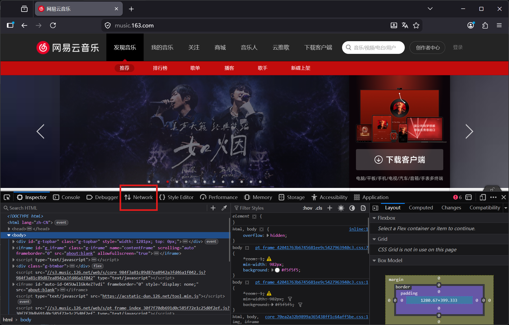
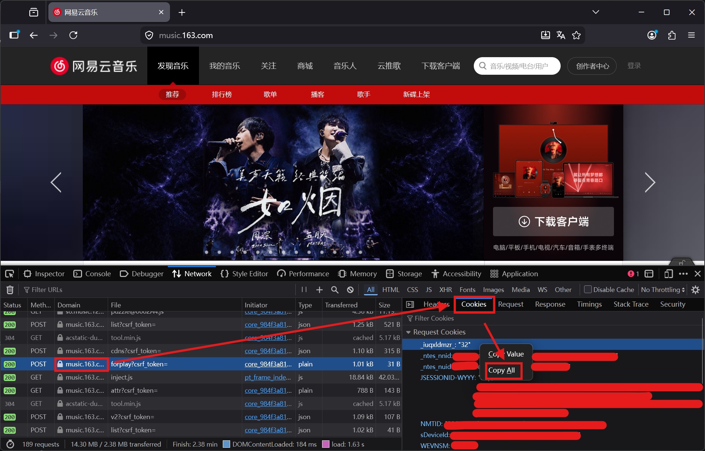

## 获取网易云音乐 Cookie

### FireFox

#### 1. 在浏览器中打开 [music.163.com](https://music.163.com) 并登录账号

#### 2. 按 F12 打开开发者工具 → Network(网络) 标签页



#### 3. 刷新页面，找到任意一个域名为 `music.163.com` 的请求，选择 Cookie 栏, 右击复制全部



#### 4. 将复制的 Json 中的外层 ` {"Request Cookies": ...}` 去掉, 仅保留内层对象(即`{"__csrf":"xxx",...}`)

例:

将

```json
{
  "Request Cookies": {
    "_iuqxldmzr_": "xxx",
    "_ntes_nnid": "xxx",
    "_ntes_nuid": "xxx",
    "JSESSIONID-WYYY": "xxx",
    "NMTID": "xxx",
    "sDeviceId": "xxx",
    "WEVNSM": "xxx",
    "WM_NI": "xxx",
    "WM_NIKE": "xxx",
    "WM_TID": "xxx",
    "WNMCID": "xxx"
  }
}
```

修改为

```json
{
  "_iuqxldmzr_": "xxx",
  "_ntes_nnid": "xxx",
  "_ntes_nuid": "xxx",
  "JSESSIONID-WYYY": "xxx",
  "NMTID": "xxx",
  "sDeviceId": "xxx",
  "WEVNSM": "xxx",
  "WM_NI": "xxx",
  "WM_NIKE": "xxx",
  "WM_TID": "xxx",
  "WNMCID": "xxx"
}
```

#### 5. 填入 `EBNR_COOKIE` 环境变量, 如果必要可以删除 Json 中所有换行与空格后再填入.
